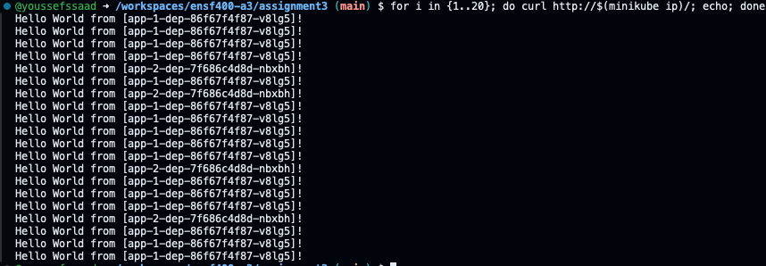

# STEP 1
The nginx-dep.yaml file is responsible for defining the deployment. This deployment has 5 replicas which means 5 identical copies of the pod. Kubernetes ensures that the specified number of Pods are always running and available. The reason we use replicas is that it can ensure that the application remains available regardless if a pod crashes. More specifically, for this assignment they serve the purpose of load balancing. Incoming traffic is distributed across the several pods. Lastly, they conveniently help with scaling as you can easily create more or less pods based on need. For this step, we use the nginx image which is premade for us instead of making the whole image from scratch. We are expecting action on port 80.

# STEP 2
A configmap stores data in key-value pairs. This allows you to reconfigure the application at will without the need to rebuild/redeploy. Configmaps can be used for many cases such as storing external configuration data, setting environment variables, or even storing config files. Here we defined the configuration of the default.conf and the config file instead of having to work directly within the image. 

# STEP 3
This step is just implementing the configmap as mentioned in step 2. For our deployment, we mount this configmap as a volume in the nginx-dep.yaml file. This makes our setup more modular allowing us to make big changes without having to rewrite many files.

# STEP 4
The purpose of a service file allows you to access the pods without needing to know their IP adresses. Instead, a service endpoint is used to access the set of pods that make up our nginx application here. As with the purpose of our work, we aim to have many instances running across various nodes. This allows for high availability and load balancing as mentioned above. Furthermore, we use ClusterIP. This is the default config type. ClusterIP makes the service only reachable from within an internal cluster on a cluster-internal IP. Lastly, the label selectors ensure that we use the correct pods from our nginx-dep.yaml file.

# STEP 5
An Ingress is a resource designed to allocate external access to the services within a cluster. For our case here, we use HTTP traffic. It is a user defined routing layer to direct the cluster's services. Through ingress, we can expose multiple services under a single IP address. This helps in loadbalancing ofcourse because it allows us to route to different backend services based on the request host or path. Traffic will be distributed efficiently. Through path-based routing, we can route to different backend services based on the URL path. This is done in our case as redirecting the requests to path / to the backend service nginx-svc. Also, we use nginx as the ingress controller to configure the routing. 

# STEP 6
For this step, it is just a repeat of the file setup for nginx but this is for each app specifically. It is important we define dep and svc for each app independently because each one defines how traffic is routed and how the application is managed in an app specific way. Also, when it comes to scaling, each scale can be identified in a specific manner. As a result, we are able to benefit from the effects of traffic routing, load balancing which is done through distributing traffic across pods, and a sense of abstraction when it comes to covering the details of operation. All done in a specific manner adapted for each app.

# STEP 7
This step is also an implementation of the ingress file from before but done in an app specific way. Through this app speciffic ingress file, we are able to control the rollout thorugh directing incoming traffic. We use this through our canary deployment strategy. App-2 is our canary deployment which means testing the updates will be done through it while app-1 serves as the stable version. This strategy is very interesting as it allows us to make and test app changes without affecting the entire system deployment. This is crucial in the case that the test is flawed or crashes, as you probably do not want every user to be affected. The way it works is that 30% of the user traffic is routed to app-2 which has the new updates and meant to be a test to see how users react. The ingress routing works normally with the addition of the traffic splitting.

# Debugging
As I configured the assignment, I ran into some issues. These commands helped me figure out the issues. Firstly `kubectl get endpoints` helped me make sure that my services had endpoints and were listening on the correct port. From this command, I realized one of the errors I had was my ports were not aligned. `kubectl logs ...` would give me the log information so that I can try to debug the code. It would sometimes say that my file is written incorrectly or something isn't matched up. `kubectl get pods` helped me check if the pods were actually running and ready as they should be. If I noticed an issue here, it would mean I should look through my dep files and ensure things are set-up smoothly. 

# Commands
kubectl delete pods --all
kubectl delete deployments --all
kubectl delete svc --all
kubectl delete ingress --all
kubectl delete configmap --all
kubectl apply -f nginx-dep.yaml
kubectl apply -f nginx-configmap.yaml
kubectl apply -f nginx-svc.yaml
kubectl apply -f app-1-dep.yaml
kubectl apply -f app-1-svc.yaml
kubectl apply -f app-2-dep.yaml
kubectl apply -f app-2-svc.yaml
kubectl apply -f nginx-ingress.yaml
kubectl apply -f app-1-ingress.yaml
kubectl apply -f app-2-ingress.yaml
kubectl get deployments
kubectl get svc
kubectl get ingress
kubectl get pods
for i in {1..20}; do curl http://$(minikube ip)/; echo; done